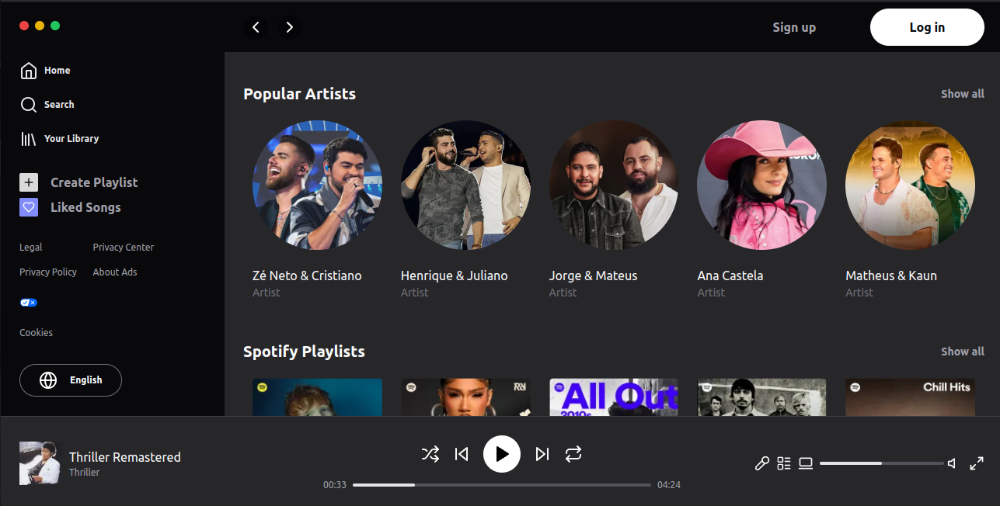
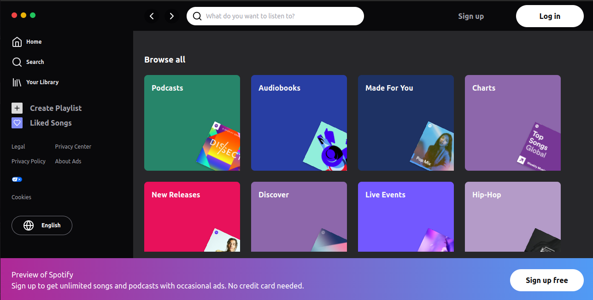
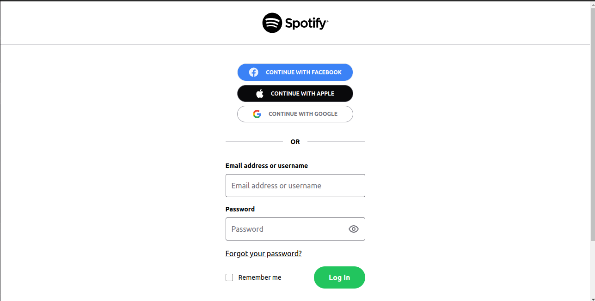

### Projeto independente (Público) - 2024

### **_Clone Frontend Spotify_**

#### Sobre o projeto:

- Clone Frontend do Spotify Web utilizando o Next.js, Typescript e TailwindCss.

### Screenshots do projeto





### Principais tecnologias usadas no desenvolvimento:

- TypeScript
- Next.js
- TailwindCss

### Bibliotecas em destaque:

- TailwindCss
- tailwind-variants

### Design

<a href="https://www.figma.com/community/file/1235147337276835126/spotify-ui-free-ui-kit-recreated?searchSessionId=lwb8hjgk-b0icyj9gsva" target="_blank">

</a>

### Etapa do desenvolvimento:

- Em desenvolvimento

### Passo-a-passo para rodar a aplicação:

1. Entre na pasta Spotify-Frontend;
2. use o comando: **_yarn_** ou **_npm install/i_** para instalar os pacotes;
3. use o comando:

```bash
npm run dev
# or
yarn dev
# or
pnpm dev
```
